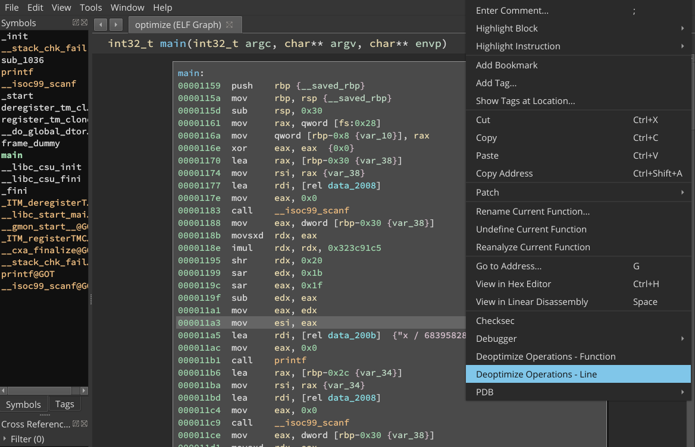
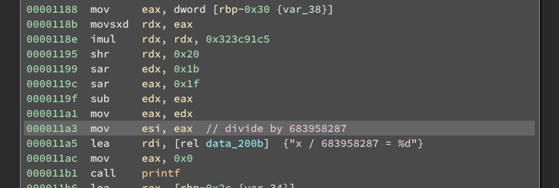
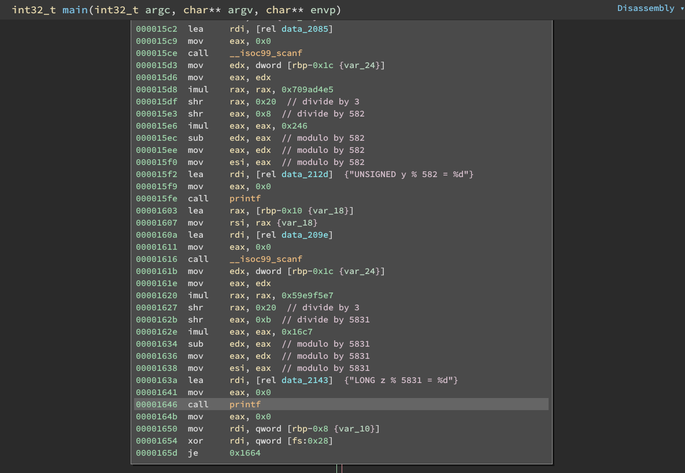

# Binary Ninja Division and Modulo Deoptimizer

This plugin uses z3 and a binary search to deoptimize divisions and modulos in binary ninja. It operates on MLIL, so it should be architecture agnostic. Because z3 is used and instructions are followed, the deoptimization is also pattern agnostic, so different compiler optimizations should still work.

It works by following the operands of a SSA MLIL instruction. After following the operands, the z3 value representing the final MLIL variable will be a function of an unconstrained input variable. We can use a binary search with different arguments to that function to determine what the actual divisor is.

Notes about speed: This is slow. It takes about a second per MLIL instruction tested, so large functions will not be analyzed quickly. There are a couple easy speed improvements that can be made, and some more complex ones. Testing every other MLIL line should still catch most if not all divisions/modulos, only running the division pass or modulo pass, not analyzing instructions that are too far away from relevant arethmetic are some examples of potential speed improvements, and reusing analysis effort on nearby lines are some potential future speed improvements.

# Usage

The plugin registers two commands - "Deoptimize Operations - Function" and "Deoptimize Operations - Line". 



For "Deoptimize Operations - Line", open the context menu on the line in which the result of the division is stored in a register or IL variable. Then run the analysis, and if a division is found, a comment will be added.



To analyze every line in the current function, run "Deoptimize Operation - Function".



# Installation

Clone or symlink this repository into your plugin folder. (https://docs.binary.ninja/guide/plugins.html#using-plugins)

In addition, ensure that `z3-solver` is installed in your python environment.

# Known Failures

These failures are caused by the incomplete impletation of the MLIL.

 - 64 bit dividing or performing modulos by very large numbers.
 - 32 bit, when large enough numbers are used that `__divdi3` and similar methods are called.
```c
    int b;
    unsigned long e;
    scanf("%d", &b);
    printf("b / 435939234853 = %d", x / 435939234853); // Doesn't work
    scanf("%ld", &e);
    printf("UNSIGNED LONG b / 435939234853 = %ld", x / 435939234853); // Also doesn't work
    scanf("%d", &b);
    printf("b % 435939234853 = %d", x % 435939234853); // Still doesn't work
    scanf("%ld", &e);
    printf("UNSIGNED LONG b % 435939234853 = %ld", x % 435939234853); // Still doesn't work
```

 - 64 bit, divide or modulo by 32, and possibly other powers of 2. There's an issue with variable sizes so that a division of a 4-byte int results in 9223372032559808544, which is technically correct... `c_int(9223372032559808544).value == 32`. Modulo doesn't have any result.
